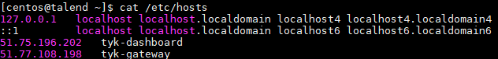

# Procédure d'installation de Tyk sur 2 machines

## Description de l'environnement
- Tyk\-Dashboard
- Tyk\-Gateway
- Tyk\-Pump
- Redis
- MongoDb

## Description de l'architecture :
- Dashboard : Dashboard + MongoDB + Pump
- Gateway : Gateway + Redis

## Adresse IP et DNS :
Environnement | IP | DNS
----------| -----------|----------------
Dashboard | 51.75.196.202 | tyk-dashboard 
Gateway | 51.77.108.198  | tyk-gateway 

## Documentation Officielle :
- https://tyk.io/docs/get-started/with-tyk-on-premise/installation/redhat-rhel-centos/

## Installation et configuration des serveurs
### Installer le serveur Dashboard
#### Configurer le serveur
##### Ouverture du port 3000 - Nécessaire à l'accès au serveur Web
Attention, ici nous ajoutons l'ouverture à la Zone Public ( représente l’ensemble des réseaux publics ou non sécurisés. On ne fait pas confiance aux autres ordinateurs ou serveurs mais, on peut traiter les connexions entrantes au cas par cas à l’aide de règles. )

```{.copyWrapper}
firewall-cmd --zone=public --add-port=3000/tcp 
```

##### Besoin de gérer les DNS localement en éditant le fichier /etc/hosts
Afin de pouvoir respecter les bonnes pratiques, il vaut mieux utiliser les DNS que les adresses IP. 
Pour ce faire, sur l'environnement de développement , nous allons donc mapper les deux serveurs localement, avec une DNS dans le fichier /etc/hosts

```{.copyWrapper}
sudo vi /etc/hosts
```
Ajouter les lignes mappant IPs et DNS, soit ici : 
```{.copyWrapper}
51.75.196.202   tyk-dashboard
51.77.108.198   tyk-gateway
```

Voici un exemple du fichier hosts configuré pour l'exemple.



#### Installation des packages nécessaires
##### Python
```{.copyWrapper}
sudo yum install python34
```

##### Set up YUM Repositories
###### STEP 1 : we need to install some software that allows us to use signed packages:
```{.copyWrapper}
sudo yum install pygpgme yum-utils wget
```

###### STEP 2 : we need to configure repository configurations for Tyk Dashboard
```{.copyWrapper}
sudo vi /etc/yum.repos.d/tyk_tyk-dashboard.repo
```

###### STEP 3 : Copier la configuration suivante dans le fichier 
```{.copyWrapper}
[tyk_tyk-dashboard]
name=tyk_tyk-dashboard
baseurl=https://packagecloud.io/tyk/tyk-dashboard/el/7/$basearch
repo_gpgcheck=1
gpgcheck=1
enabled=1
gpgkey=http://keyserver.tyk.io/tyk.io.rpm.signing.key
       https://packagecloud.io/tyk/tyk-dashboard/gpgkey
sslverify=1
sslcacert=/etc/pki/tls/certs/ca-bundle.crt
metadata_expire=300
```

> **Rappels Vim** 
>
> * Pour passer en mode Edition, appuyer sur i. 
> * Pour passer en mode commande, appuyer sur échappement. 
> * Pour sauvegarder et quitter le fichier, mode commande : ***:wq!*** 

###### STEP 4 : we need to configure repository configurations for MongoDB
```{.copyWrapper}
sudo vi /etc/yum.repos.d/mongodb-org-3.0.repo
```

###### STEP 5 : Copier la configuration suivante dans le fichier
```{.copyWrapper}
[mongodb-org-3.0]
name=MongoDB Repository
baseurl=https://repo.mongodb.org/yum/redhat/$releasever/mongodb-org/3.0/x86_64/
gpgcheck=0
enabled=1
```

###### FINAL STEP : Raffraichir le cache local
```{.copyWrapper}
sudo yum -q makecache -y --disablerepo='*' --enablerepo='tyk_tyk-dashboard'
```

##### Install Packages
Maintenant que les repositories sont configuré, on peut lancer l'installation des packages
```{.copyWrapper}
sudo yum install -y mongodb-org tyk-dashboard redis
```
##### Start MongoDB and Redis

Au cas où les services ne sont pas démarrés.

```{.copyWrapper}
sudo service mongod start
sudo service redis start
```

##### Configurer Tyk Dashboard

> **NOTE**: 
> You need to replace `<hostname>` for `--redishost=<hostname>`
> You need to replace `<IP Address>` for `--mongo=mongodb://<IP Address>/` 
> You need to replace `<host_tyk_node>` for `--mongo=mongodb://<IP Address>/` 
> You need to replace XXX.XXX.XXX.XXX for `--domain="XXX.XXX.XXX.XXX"` 
> with your own values to run this script.


__*Exemple Générique*__
```{.copyWrapper}
sudo /opt/tyk-dashboard/install/setup.sh --listenport=3000 --redishost=<hostname> --redisport=6379 --mongo=mongodb://<IP Address>/tyk_analytics --tyk_api_hostname=$HOSTNAME --tyk_node_hostname=http://<host_tyk_node> --tyk_node_port=8080 --portal_root=/portal --domain="XXX.XXX.XXX.XXX"
```

__*Soit pour notre déploiement*__
```{.copyWrapper}
sudo /opt/tyk-dashboard/install/setup.sh  --listenport=3000 --redishost=tyk-gateway --redisport=6379 --mongo=mongodb://localhost/tyk_analytics --tyk_api_hostname=tyk-dashboard --tyk_node_hostname=http://51.77.108.198 --tyk_node_port=8080 --portal_root=/portal --domain="51.75.196.202" 
```

> **Note**: Make sure to use the ***actual DNS hostname*** or the public IP of your instance as the last parameter.

What we have done here is:

*   `--listenport=3000`: Told Tyk Dashboard (and Portal) to listen on port 3000.
*   `--redishost=<hostname>`: Tyk Dashboard should use the local Redis instance.
*   `--redisport=6379`: The Tyk Dashboard should use the default port.
*   `--domain="XXX.XXX.XXX.XXX"`: Bind the Dashboard to the IP or DNS hostname of this instance (required).
*   `--mongo=mongodb://<IP Address>/tyk_analytics`: Use the local MongoDB (should always be the same as the Gateway).
*   `--tyk_api_hostname=$HOSTNAME`: The Tyk Dashboard has no idea what hostname has been given to Tyk, so we need to tell it, in this instance we are just using the local HOSTNAME env variable, but you could set this to the public-hostname/IP of the instance.
*   `--tyk_node_hostname=http://localhost`: The Tyk Dashboard needs to see a Tyk node in order to create new tokens, so we need to tell it where we can find one.
*   `--tyk_node_port=8080`: Tell the Dashboard that the Tyk node it should communicate with is on port 8080.
*   `--portal_root=/portal`: We want the Portal to be shown on /portal of whichever domain we set for the Portal.

##### Démarrer Tyk Dashboard

```{.copyWrapper}
sudo service tyk-dashboard start
```

##### Ajouter la licence dans le fichier de configuration du Dashboard & relancer le service

```{.copyWrapper}
sudo vi /opt/tyk-dashboard/tyk_analytics.conf
```

Rechercher le champ **"license_key": ""** et insérer la clef entre les 2 guillemens

```{.copyWrapper}
restart tyk-dashboard.service
```

### Installer le serveur Gateway

##### Ouverture du port 8080 - Nécessaire au transport des API
Attention, ici nous ajoutons l'ouverture à la Zone Public ( représente l’ensemble des réseaux publics ou non sécurisés. On ne fait pas confiance aux autres ordinateurs ou serveurs mais, on peut traiter les connexions entrantes au cas par cas à l’aide de règles. )

```{.copyWrapper}
sudo firewall-cmd --zone=public --add-port=8080/tcp
```
##### Ouverture du port 6379 - Nécessaire pour l'interface Redis
Attention, ici nous ajoutons l'ouverture à la Zone Public ( représente l’ensemble des réseaux publics ou non sécurisés. On ne fait pas confiance aux autres ordinateurs ou serveurs mais, on peut traiter les connexions entrantes au cas par cas à l’aide de règles. )

```{.copyWrapper}
sudo firewall-cmd --zone=public --add-port=6379/tcp
```

##### Set up YUM Repositories
###### STEP 1 : we need to install some software that allows us to use signed packages:
```{.copyWrapper}
sudo yum install pygpgme yum-utils wget
```

###### STEP 2 : we need to configure repository configurations for Tyk Dashboard
```{.copyWrapper}
sudo vi /etc/yum.repos.d/tyk_tyk-gateway.repo
```

###### STEP 3 : Copier la configuration suivante dans le fichier 
```{.copyWrapper}
[tyk_tyk-gateway]
name=tyk_tyk-gateway
baseurl=https://packagecloud.io/tyk/tyk-gateway/el/7/$basearch
repo_gpgcheck=1
gpgcheck=1
enabled=1
gpgkey=http://keyserver.tyk.io/tyk.io.rpm.signing.key
       https://packagecloud.io/tyk/tyk-gateway/gpgkey
sslverify=1
sslcacert=/etc/pki/tls/certs/ca-bundle.crt
metadata_expire=300
```

###### STEP 4 : Installer EPEL pour enrichir les repositories 
```{.copyWrapper}
sudo yum install -y epel-release
sudo yum update
```

###### STEP 5 : Mettre le cache a jour
```{.copyWrapper}
sudo yum -q makecache -y --disablerepo='*' --enablerepo='tyk_tyk-gateway' --enablerepo=epel
```


###### STEP 6 : Installation de Redis et du Gateway
```{.copyWrapper}
sudo yum install -y redis tyk-gateway
```


###### STEP 6 : Configuration de Redis
####### Ouvrir le flux entrant à partir du Dashboard
```{.copyWrapper}
sudo vi /etc/redis.conf
```

Commenter la partie : bind tel que sur la capture d'écran ci-dessous
